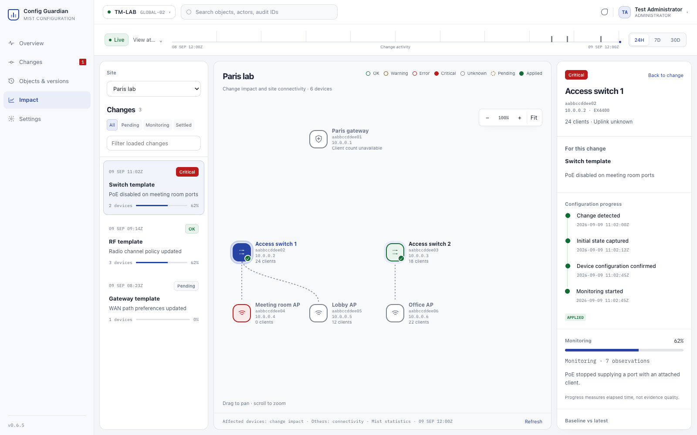

# Site Impact workspace

The primary `/impact` route presents one site's configuration events next to its observed device topology. `/impact/sessions?session=…` retains the detailed collection evidence. Existing `/impact?session=…` links redirect there.

## Interaction

- Select a site, then a change to see its affected devices, monitoring progress, and deployment evidence. One audit appears once per site, even when it changes many devices.
- Select a device to see its history. With a change selected, an affected device shows that change's evidence; an unrelated device shows its own history and an explicit scope notice.
- Clicking the same change or device toggles it. Selecting a change clears the device; selecting a history item retains the device. Changing sites or time scope clears the previous selection.
- Drag to pan; wheel to zoom at the pointer; use the visible zoom buttons or keyboard `+`, `-`, arrows and `Home`. Dragging a node does not select it. Selection never changes zoom. Site switches preserve manual zoom and reset pan.
- Below 1040px of workspace width, details overlay the diagram. Below 650px, a Changes button opens the rail. Each long pane scrolls independently within the remaining page height.
- The rail filters its **loaded** events; load more to search older events. Refresh reloads all loaded pages and preserves selection. Live mode refreshes every minute.

## Data semantics

Health colors mean current connectivity before a change is selected, and the selected change's measured impact for affected devices afterward. Out-of-scope devices retain their current connectivity state. The diagram labels this distinction. A connected device is **Unknown**, not automatically OK; opening a change exposes its actual evidence. Missing devices from topology remain visible as unknown monitoring identities. AP-to-switch links require an exact LLDP chassis match, including virtual-chassis member MACs. No switch-to-gateway link is fabricated when statistics contain no physical-neighbor identity.

A config acknowledgement is separate from network health. Monitoring progress is elapsed time over the planned window; 100% does not prove sufficient collection. A stalled or aborted collection remains explicit. The existing deterministic PoE disruption and recovery policy is unchanged. If concurrent audits shared a session, the UI discloses that attribution is not exclusive.

Historical topology comes from stored object versions. Live links, client counts and health are withheld. Historical lifecycle events are limited by receipt time; late-linked audits cannot borrow future device attribution. Historical verdicts are withheld because the stored session verdict is mutable and cannot reconstruct what was known then. Site names in the selector are current inventory labels, not a historical renaming ledger.

## Read API

All endpoints are under `/api/v1/organizations/{organization_id}/impact` and require the existing viewer-or-higher authenticated access. Site routes reject IDs absent from that organization's stored inventory and monitoring history. No restore/configuration writes are introduced.

| GET path | Query | Result |
| --- | --- | --- |
| `/sites` | `as_of` optional ISO instant | `{items: [{id, name}]}` from known sites and monitoring history; each source capped at 5000 |
| `/sites/{site_id}/topology` | `as_of` optional ISO instant | `SiteTopology`: allowlisted device identities, kind/model/IP/client count, observed parent/uplink, layout coordinates, health, collection time, source, completeness and warnings |
| `/sites/{site_id}/changes` | `range=24h\|7d\|30d`, optional `as_of`, `skip>=0`, `limit=1..100` (default 50) | `SiteChangeList`: items, total event count, effective instant, historical flag, completeness and warnings |

`SiteChange` includes the audit/group identity, actor, occurrence time, title/type, summary and per-device impacts. Each device impact contains its session ID, config state, observed milestone timestamps, monitoring state/percentage/count, current impact severity, headline, baseline/latest metric pairs, collection errors and overlapping-window flag. Multiple sessions for one device/audit resolve to the latest session. No raw telemetry arrays, encrypted provider fields or AI prompts are sent in the event list.

Events are paginated **before** device summaries are expanded. Audit events use the site's affected-site membership, and uncorrelated sessions remain explicit independent events. Expansion is capped at 5000 windows per response; truncation is disclosed through `complete=false` and warnings. Organization/site indexes support both event and session selection. Live topology fetches the read-only Mist site device statistics endpoint with `type=all`, in at most five pages of 1000 devices. Failed live collection falls back to stored inventory with a visible warning and sanitized error information. It does not fall back to another site or organization.

The exact schemas and validation constraints are generated in [`../openapi.json`](../openapi.json). Changes are additive; existing monitoring and change-group APIs remain available.

## SLE contract correction

The corrected `docs/mist_sles.md` examples use `sle/ap/{device_uuid}` for APs, `sle/switch/{device_uuid}` for switches and `sle/gateway/{device_uuid}` for gateways. The collector follows these family scopes for both discovery and summary-trend requests; site collection retains `sle/site/{site_uuid}`. It recognizes `failed-to-connect`, `ap-availability`, `switch-bandwidth`, `gateway-bandwidth`, and `application-health` when advertised by discovery. Previously supported names remain accepted when the provider explicitly advertises them; they are not silently remapped to differently named historical metrics.

The corrected examples agree with Juniper's published OpenAPI scope enum and supersede the earlier generic `device` URL scope. Persisted observations still distinguish device measurements from site measurements using their existing `device`/`site` classification. Actual deployment validation with a read-only token remains necessary, especially discovery behavior. HTTP errors remain errors, quiet samples remain `no_data`, and an empty numeric comparison cannot imply health. No stored baseline formula or historical collection error is rewritten.

References: [Juniper SLE summary-trend API](https://www.juniper.net/documentation/us/en/software/mist/api/http/api/sites/sles/get-site-sle-summary-trend), [SLE and Insights guidance](https://www.juniper.net/documentation/us/en/software/mist/automation-integration/topics/concept/api-mist-metrics.html), [site device statistics](https://www.juniper.net/documentation/us/en/software/mist/api/http/api/sites/stats/devices/list-site-devices-stats).

## Verification

- `MONGO_TEST_URL=mongodb://127.0.0.1:27028 make check` also exercises the site aggregation and existing restore search against a disposable MongoDB 8 instance. Database tests use scratch databases, never application data. Without this environment variable they are skipped.
- `make check`: backend formatting, lint, types, tests, deterministic OpenAPI check; frontend tests and production build.
- `cd frontend && npm run test:browser`: Playwright regression suite with API fixtures, Chrome and a local Angular server. No production service or Mist org is contacted. To use Playwright's bundled browser, install it with `npx playwright install chromium` and set `PLAYWRIGHT_CHANNEL=chromium`.
- Browser artifacts are written to ignored `frontend/test-results/`; scenarios cover four selection states, pan/zoom, responsive overlay, mobile rail, exact UTC and keyboard time selection, bounded object/change tables and immediate change details.
